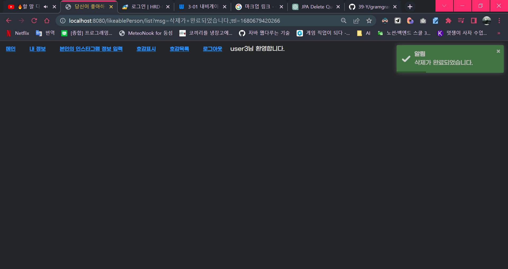
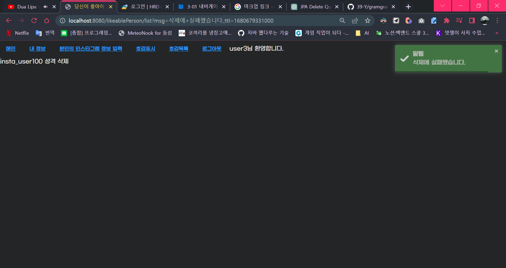

## Title: [1Week] 양혜정

### 미션 요구사항 분석 & 체크리스트

---

- 필수미션
  - [x] 호감상대 삭제
    - [x] /delete 요청시 LikeablePerson이 삭제된다.
    - [x] /delete 요청은 로그인 상태에서만 가능
    - [x] /delete 요청은 인스타 아이디와 연동된 상태만 가능
    - [x] /delete 요청은 본인만 가능
    - [x] /delete 완료시 리스트 페이지로 redirect
- 추가미션
  - 구글 로그인 연동 

### 1주차 미션 요약

---

 미션 요약 쓰기 요령

- 체크리스트를 중심으로 각각의 기능을 구현하기 위해 어떤 생각을 했는지 정리합니다.
- 무엇에 중점을 두고 구현하였는지, 어떤 공식문서나 예제를 참고하여 개발하였는지 뿐만 아니라 미션을 진행하기 전 개인적으로 실습한 것도 포함하여 작성해주시기 바랍니다.
- 실제 개발 과정에서 목표하던 바가 무엇이었는지 작성해주시기 바랍니다.
- 구현 과정에 따라 어떤 결과물이 나오게 되었는지 최대한 상세하게 작성해주시기 바랍니다.

 

#### 중점 포인트
- SpringBoot와 MVC 모델, JPA에 익숙해지고, 미션 기능을 에러 없이 기능을 구현하는 것
  

#### 참고 자료
- [점프 투 스프링부트: 수정과 삭제](https://wikidocs.net/161986)
- [chatGPT: delete 결과가 반영되지 않는 이유](https://chat.openai.com/chat/c765ba5e-1def-447b-9bf7-ce3bcbb8f274)
- [기존 GramGram repository](https://github.com/39-Y/gramgramtest)
  

#### 주요 목표: LikeablePerson 삭제
1) service에서 repository를 이용하여 delete 구현
   1) 요청된 LikeablePerson의 id를 이용하여 Entity구하기
   2) Entity가 존재하면 삭제함
   3) 즉각 flush()하기 위해서 @transactional 이용
1) controller에서 결과 출력
   2) serivce에서 RsCode를 이용하여 메시지 받기
   3) 실패할 경우 실패 메시지 띄우기

#### 결과물
- 기존 상태
  - user3는 user100을 호감상대로 추가함
- 원하는 결과
  - user3가 호감 표시한 상대가 아예 없는 상태
- 성공적으로 삭제했을 때

- 의도적으로 http에 잘못된 삭제 id를 부여했을 경우

**[특이사항]**
- 아쉬웠던 점
  - 데이터를 null로 처리하는 것은 위험하다고 하는데, null 없이 깨끗하게 처리해보고 싶습니다.
  - 테스트 케이스를 작성하지 못해서 tdd적인 개발이 되지 않았습니다.
  - 실패했을 경우 알림이 다른 색깔로 뜨도록 구현하고 싶습니다.
  - 다음 미션에서는 선택 기능까지 구현해보고 싶습니다.
- 궁금했던 점
  - delete()가 영속성 컨텍스트의 문제 때문에 뜨지 않은 것은 알지만, 뭔가 와닿지 않습니다.

  **[Refactoring]** 
  - [x] LikeablePersonServicecontroller에 있는 비즈니스 코드 옮기기
  - [x] 좀 더 자세한 실패 메시지 처리
  - [x] delete 과정에 있는 중복 코드 처리
  - [ ] 테스트 작성을 통해서 tdd한 개발을 합니다.
  - [ ] null을 사용하지 않고 예외처리를 합니다.
  - [ ] 프론트에서 알림창의 색깔을 메시지에 따라서 처리합니다.