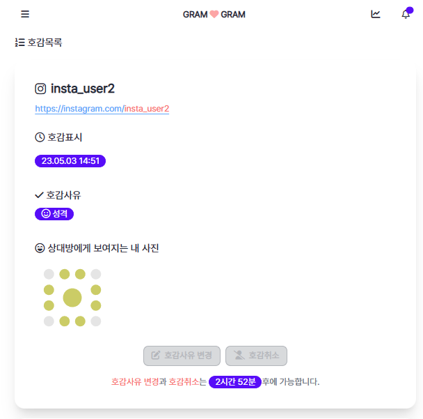
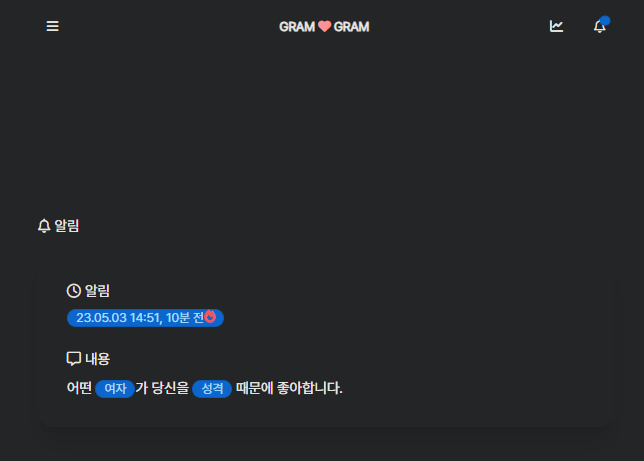

## Title: [3Week] 양혜정

### 미션 요구사항 분석 & 체크리스트

---

- 필수미션
    - [x] 호감표시/호감사유변경 후 3시간 동안 호감취소와 호감사유변경을 막는 기능
        - [x] /cancel 요청시 LikeablePerson 쿨타임을 확인
        - [x] /modified 요청시 LikeablePerson 쿨타임을 확인
        - [x] 쿨타임이 현재 시간보다 클 경우 실패 메시지 출력
        - [x] UI에 변경 가능 시간 표시
- 추가미션
    - [x] 알림 기능
        - [x] /modified 요청시 NotificationEvent 발행
        - [x] /like 요청시 NotificationEvent 발행
        - [x] event listener에서 notification service에게 notification 생성 요청
        - [x] 생성된 notifacation UI에 표시
        - [x] 알림창 방문시 readDate update
        - [x] 알림에 변경 경과 시간 표시
      
        

### 3주차 미션 요약

---

 미션 요약 쓰기 요령

- 체크리스트를 중심으로 각각의 기능을 구현하기 위해 어떤 생각을 했는지 정리합니다.
- 무엇에 중점을 두고 구현하였는지, 어떤 공식문서나 예제를 참고하여 개발하였는지 뿐만 아니라 미션을 진행하기 전 개인적으로 실습한 것도 포함하여 작성해주시기 바랍니다.
- 실제 개발 과정에서 목표하던 바가 무엇이었는지 작성해주시기 바랍니다.
- 구현 과정에 따라 어떤 결과물이 나오게 되었는지 최대한 상세하게 작성해주시기 바랍니다.

 

#### 중점 포인트
- SpringBoot Event에 익숙해지고, 미션 기능을 MVC에 맞게 구현
    

#### 참고 자료
- [기존 GramGram repository](https://github.com/39-Y/gramgramtest)
    

#### 주요 목표: 쿨타임 끝나지 않으면 변경 불가
1) service에서 쿨타임을 이용하여 can 메소드 수정
    1) LikeablePerson의 쿨타임을 이용하여 수정 가능 여부 확인 
    2) 수정 불가할 시에 메시지 출력
#### 추가 목표: 알림 기능 구현
1) Notification Event 생성
   1) Event-listener로 LikeablePerson 생성 및 수정 시에 Notification 생성
   2) 생성, 수정에 따라서 field 구성 변경
2) Notification List page 수정
   1) toInstaMember에 해당하는 List를 페이지에서 출력
   2) 알림에 생성, 변경 후 경과 시간 표시
   3) notification의 typecode에 따라서 출력 메시지 변경
   4) list page에 방문할 때 읽지 않은 알림 readDate 설정
   5) 읽지 않은 알림은 아이콘으로 표시
#### 결과물
- 기존 상태
    - front에서만 쿨타임이 지나지 않은 LikeablePerson 수정을 막아놓음
    - 알림 페이지는 정적 코드로 고정
- 원하는 결과
    - back에서도 쿨타임이 지나지 않은 LikeablePerson 수정 못하도록 막음
    - 알림 메시지에서 읽지 않은 알림과 읽은 알림을 구분해서 볼 수 있음
- 쿨타임이 지나지 않았을 때 변경 UI
  
- 알림 페이지
  

**[특이사항]**
- 아쉬웠던 점
    - 쿨타임이 실시간으로 새로고침이 되면서 연동되면 좋을 것 같습니다.
    - 알림 nav에서 읽지 않은 알림을 볼 수 있는 기능을 넣고 싶습니다.
    - 테스트 케이스를 작성하지 못해서 tdd적인 개발이 되지 않았습니다.
- 궁금했던 점
    - event 발행의 위치는 controller, service 둘다 상관없을지 궁금합니다.

  **[Refactoring]**
    - [x] LikeablePersonServicecontroller에 있는 비즈니스 코드 옮기기
    - [x] 좀 더 자세한 실패 메시지 처리
    - [x] delete 과정에 있는 중복 코드 처리
    - [ ] 테스트 작성을 통해서 tdd한 개발을 합니다.
